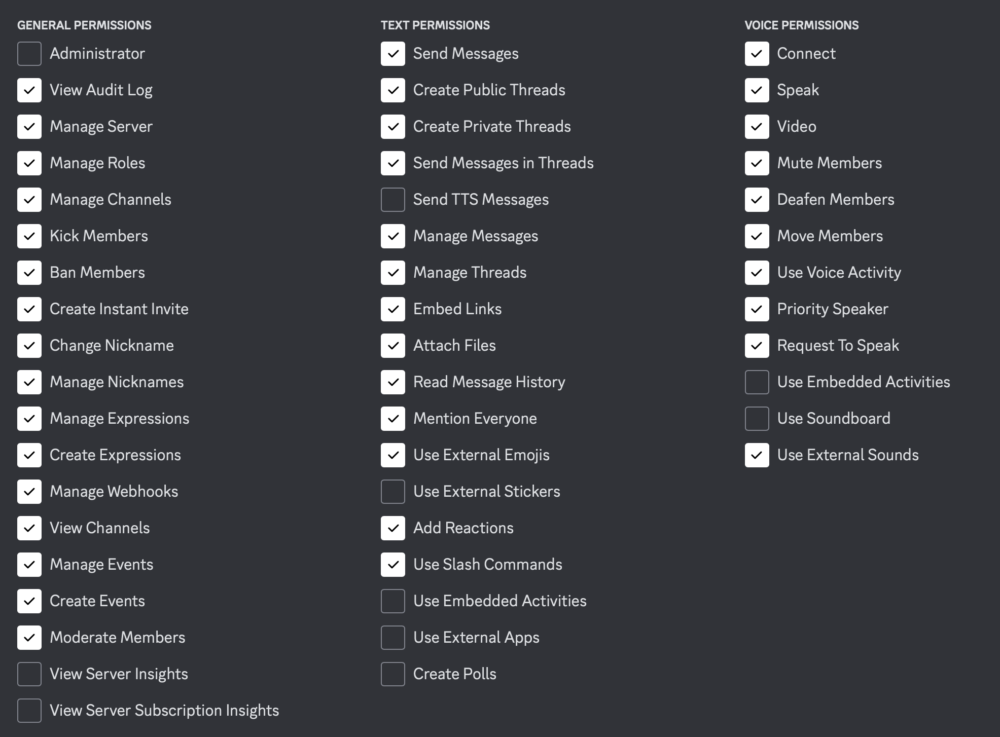

# Preparation

<br>

## Cloning the repository

Before we continue on with the upcoming procedures, let's make sure we actually have IgKnite downloaded on the machine of your choice.

In order to clone IgKnite directly from [GitHub](https://github.com/), make sure you have [Git](https://www.git-scm.com) installed. Then, run the following command:

```bash
# using HTTPS
$ git clone https://github.com/IgKniteDev/IgKnite.git

# using SSH
$ git clone git@github.com:IgKniteDev/IgKnite.git

# using the GitHub CLI
$ gh repo clone IgKniteDev/IgKnite
```

As you can see, there are actually three different commands for you to choose from. This is typically provided by GitHub right at the repository home page, but we've written it here so you don't have to search :P

<br>

## Creating the bot

Like actual human DIscord accounts, bots also need to be created in a rather fancy manner. If you have created Discord bots previously then this step might be familiar. If not, don't worry, that's what the documentation is for!

If you'd like to get into more detail about this topic, kindly check out [this article from Discord]() which explores how to create, add and manage a Discord bot from scratch. But if you're more impatient, you can follow along the short path given below. Note that this might get a little misleading for some people:

- Navigate to [Discord Developer Portal](https://discord.com/developers).
- Create a new application.
- Choose **Bots** from the sidebar and enable it.

That's it! You now have a new Discord bot; ready to be online. 

<br>

But this bot is still not in your server. In order to add the bot to your personal Discord server or have a friend use it:

- Choose **OAuth2** from the sidebar and choose **URL Generator**.
- Click on `bot` and `application.commands` from the scopes view.
- Make sure you have these permissions ticked:

	
	
- Copy the link generated below and open it in a new tab.
- Choose your server, fill in the CAPTCHA and voila!

<br>

## Getting the files ready 

If you've followed the preparation step given right at the start of this chapter, you should already have IgKnite cloned onto your computer. Let's open the downloaded folder using:

```bash
# Open and list all the files.
$ cd IgKnite && ls
```

You'll see a bunch of file names appearing on your terminal. One of them is `.env.sample` and your very first steps will be to:

- Rename `.env.sample` to `.env` and save.
- Open the renamed file with your favorite code editor.

<br>

## Knowing the secrets

The file you just renamed and opened is the primary file where you'll be storing all the credentials and secrets. This is called a local environment file and we, as developers, see a ton of these every day. 

We're assuming you're seeing something similar to this on your code editor:

```
DISCORD_TOKEN=
DISCORD_OWNER_ID=
SPOTIFY_CLIENT_ID=
SPOTIFY_CLIENT_SECRET=
```

These are the four environment variables which are all mandatory for running IgKnite. Two of them can be obtained from the [Discord Developer Portal](https://discord.com/developers) and the other two from [Spotify for Developers](https://developer.spotify.com/) respectively.

<br>

## Getting the environment variables

Now we can actually go and fetch all the secrets we need. If you've previously created a Discord bot then you already know how to obtain the first two variables. If not, don't worry, that's what the documentation is for.

- Navigate to the [Discord Developer Portal](https://discord.com/developers) web page.
- Click on the application we had created previously.
- Choose **Bots** from the sidebar. 
- Copy the token.
- Paste it inside the `DISCORD_TOKEN` variable.

That's one done! If you'd like to obtain the other environment variable originating from Discord, then that's pretty easy too. You'll just have to copy and paste the ID of your Discord account in the field.

Speaking of the variables related to Spotify, those are relatively easy to get as well. To get the rest of the required secrets:

- Navigate to the [Spotify for Developers] web page.
- Choose **Dashboard** from the top bar and click on 'Create an App'.
- Copy the **Client ID** from the app's window and paste it inside the `SPOTIFY_CLIENT_ID` variable.
- Similarly, copy the **Client Secret** and paste it inside the `SPOTIFY_CLIENT_SECRETS` variable.

<br>

That's basically it! Now we are fully ready to run IgKnite.